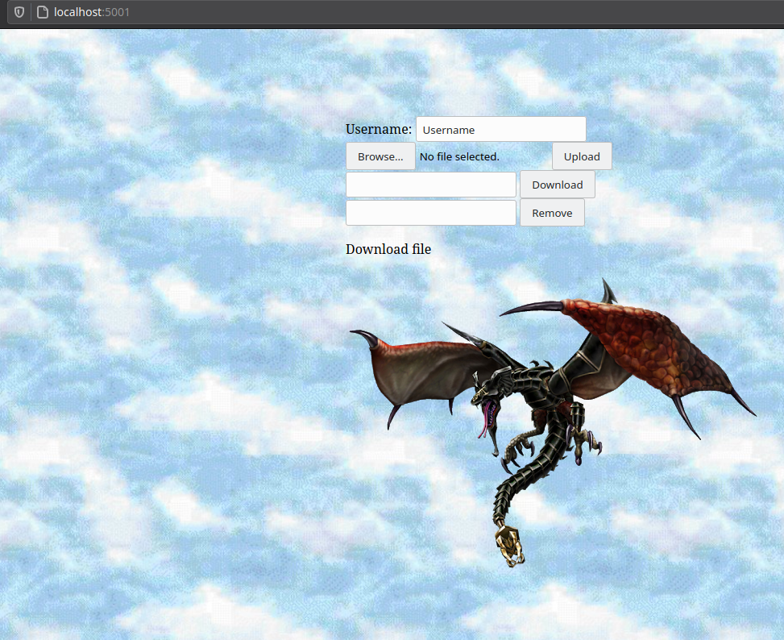

# Secure-Cloud-Storage
Assignment for Advanced Telecoms II - CSU34031 

## Brief
The aim of this project was to develop a secure cloud storage application. The application would secure all files that are uploaded to the cloud, such that only people that are part of a specified “Secure Cloud Storage Group”  would  be  able  to  decrypt uploaded files. Any member of the group should be able to upload encrypted files to the cloud service. To all other users the files would be encrypted, and unreachable. This uses 2 WSGI servers, one of which acts as the secure cloud storage application - a gateway for accessing storage, and also interacting with storage, running on localhost:5000. The other is a client capable of downloading and uploading files to the server.

## Installation and Running:
    Begin installation of necessary python libraries: `pip install -r requirements.txt`.
* To launch client on localhost:5001:
    `cd client`
    `python3 client.py`

* To launch server on localhost:5000:
    `cd server`
    `python3 server.py`

## Images

### Client

### Server
